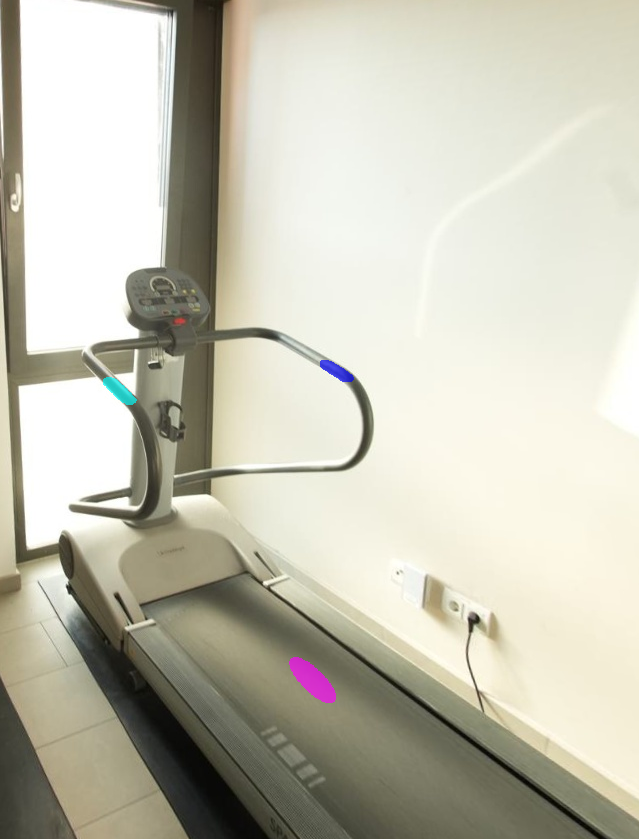
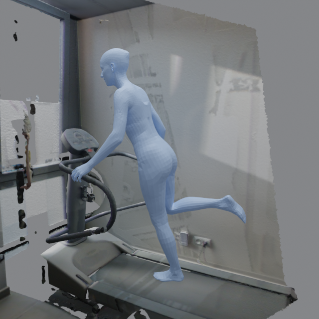
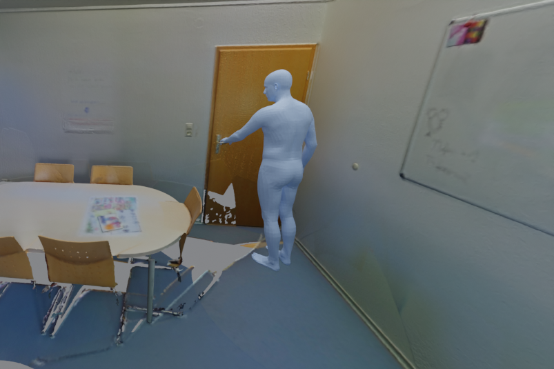
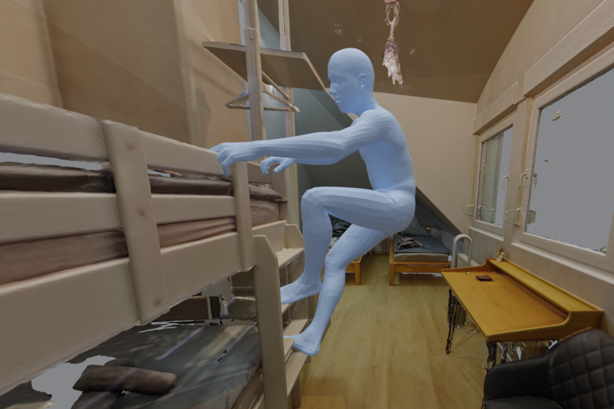

# 3DHSI

**Foundation-Model-Guided Zero-Shot Synthesis of Human–Scene Interaction**
Muhammad Umer Abbasi · Technical University of Munich · 2026

Given an instruction, a calibrated RGB view, and a reconstructed scene, the method produces one scene-grounded SMPL-X pose. It generates a human image, identifies the scene surfaces each body part should touch, verifies those contacts, and optimizes the body in 3D. It uses pretrained models without training on paired 3D human–scene interactions.

## Example

<table>
  <tr>
    <th width="38%">1. Generated interaction hypothesis</th>
    <th width="24%">2. Verified scene contacts</th>
    <th width="38%">3. Scene-grounded SMPL-X result</th>
  </tr>
  <tr>
    <td></td>
    <td></td>
    <td></td>
  </tr>
</table>

## Method

1. Generate a Scene Interaction Graph (SIG) describing target objects and body-part contacts.
2. Generate a human frame in the calibrated scene view.
3. Estimate object-contact masks, verify and correct them with a VLM, and segment floor contacts with SAM 3.
4. Recover an initial SMPL-X pose with GVHMR and transform it into scene coordinates.
5. Project contacts into 3D and optimize the pose for contact and collision.

## Results

The evaluation covers 23 interactions in 15 ScanNet++ scenes. Geometric values are means over interactions.

| Method | Mean contact distance ↓ | Mean penetration depth ↓ | CLIP ↑ | VLM contact ↑ | VLM mean ↑ |
|---|---:|---:|---:|---:|---:|
| PhySIC | 24.2 cm | 11 mm | 0.259 | 3.48 / 5 | 4.04 / 5 |
| GVHMR initialization | 16.3 cm | 17 mm | 0.270 | 2.87 / 5 | 3.75 / 5 |
| Single-shot contacts | 7.0 cm | **5 mm** | 0.271 | 3.83 / 5 | 4.27 / 5 |
| **Full method** | **3.9 cm** | **5 mm** | **0.272** | **4.00 / 5** | **4.36 / 5** |

Contact distance is the directed mean distance from a body-part contact region to its manually annotated scene region. Mean penetration depth is computed only over sampled scene points that penetrate the body, then averaged over interactions; it is not collision prevalence or volume.

The contact stage was also evaluated directly in image space, before 3D optimization:

| Contact localization | Mask containment ↑ | Centroid error ↓ | Missed contacts ↓ |
|---|---:|---:|---:|
| Single shot | 0.60 | 27.6 px | 3 |
| **Agentic loop** | **0.74** | **19.5 px** | **0** |

<table>
  <tr>
    <th width="50%">Opening a door</th>
    <th width="50%">Sitting on a bicycle</th>
  </tr>
  <tr>
    <td></td>
    <td></td>
  </tr>
  <tr>
    <th>Climbing onto a top bed</th>
    <th>Hanging from a pull-up bar</th>
  </tr>
  <tr>
    <td></td>
    <td></td>
  </tr>
</table>

## Acknowledgements

This research builds on ScanNet++, SMPL-X, GVHMR, SAM 3, PyTorch3D, VolumetricSMPL, CLIP, GenZI, and PhySIC. Please consult the respective projects for their citations, model licenses, and data-access terms.

## License

No project-level license has been assigned to this development branch. Repository access therefore does not by itself grant permission to reuse the code, data, or generated assets. Third-party components and datasets remain subject to their own terms.
